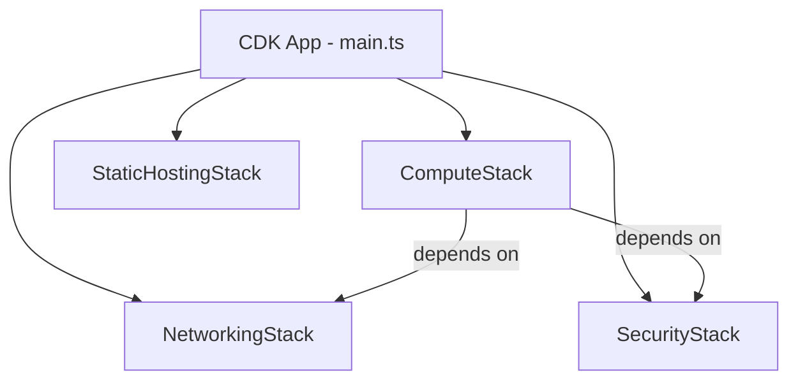
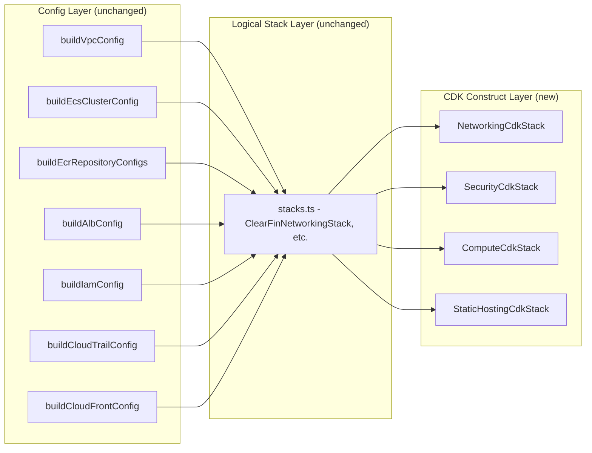
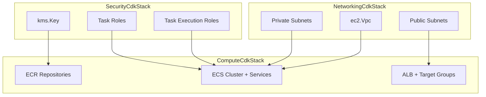

# Design Document: CDK Infrastructure Constructs

## Overview

This feature converts the existing config builder functions in `packages/infra/src` into real AWS CDK constructs that create actual AWS resources during `cdk deploy`. The current architecture has a clean separation: pure config builder functions (`buildVpcConfig`, `buildEcsClusterConfig`, etc.) return typed data structures, and placeholder CDK stacks deploy SSM parameters. This design replaces the placeholder `ClearFinCdkStack` with four dedicated CDK stack classes that consume config builder outputs and create matching AWS resources.

The key design principle is **config-first**: CDK construct code reads every parameter from the config builder output. No resource configuration is hardcoded in the construct layer. This means config builder changes automatically flow through to synthesized CloudFormation without modifying construct code.

### What Changes

- `packages/infra/src/cdk/cdk-stack.ts` — Replace the single `ClearFinCdkStack` placeholder with four real stack classes: `NetworkingStack`, `SecurityStack`, `ComputeStack`, `StaticHostingStack`
- `packages/infra/src/cdk/main.ts` — Update to instantiate the four real stacks with proper dependency ordering
- `packages/infra/src/cdk/stacks.ts` — Existing logical stack classes remain as the config-aggregation layer; the new CDK stacks wrap them

### What Stays the Same

- All config builder functions and their interfaces (vpc.ts, ecs.ts, ecr.ts, alb.ts, iam.ts, cloudtrail.ts, cloudfront.ts)
- The `CdkStackContext` interface and `buildClearFinApp` function
- The CDK context flags used by GitHub Actions (`environment`, `accountId`, `region`, `imageTag`, `domainName`, `certificateArn`)
- Existing config builder tests in `infra.test.ts`

## Architecture

### Stack Dependency Graph



### Layer Architecture



Each CDK stack class receives the corresponding logical stack (from `stacks.ts`) and iterates over its config to create real CDK constructs. The logical stack layer continues to serve as the config aggregation point, keeping the CDK construct layer thin.

## Components and Interfaces

### 1. NetworkingCdkStack

**File:** `packages/infra/src/cdk/networking-stack.ts`

Consumes `ClearFinNetworkingStack.vpcConfig` and creates:
- `ec2.Vpc` with the specified CIDR, DNS settings
- `ec2.Subnet` for each public and private subnet
- `ec2.NatGateway` with `ec2.CfnEIP` per AZ in public subnets
- `ec2.InterfaceVpcEndpoint` for ECR API, ECR Docker, STS, Secrets Manager, KMS, CloudWatch Logs, CloudWatch Monitoring
- `ec2.GatewayVpcEndpoint` for S3
- `cdk.CfnOutput` for VPC ID, public subnet IDs, private subnet IDs

```typescript
interface NetworkingCdkStackProps extends cdk.StackProps {
  clearfinEnv: string;
  vpcConfig: VpcConfig;
}
```

### 2. SecurityCdkStack

**File:** `packages/infra/src/cdk/security-stack.ts`

Consumes `ClearFinSecurityStack.iamConfig` and `ClearFinSecurityStack.cloudTrailConfig` and creates:
- `kms.Key` with alias, rotation, and key policy
- `iam.Role` for each task execution role, task role, and STS base role with trust policies and inline policies
- `s3.Bucket` for CloudTrail logs with encryption and versioning
- `cloudtrail.Trail` with log file validation, S3 destination, KMS encryption, event selectors
- `events.Rule` for each alert rule (IAM policy changes, STS trust changes, Secrets Manager policy changes)
- `sns.Topic` for security alerts, subscribed by EventBridge rules
- `cdk.CfnOutput` for KMS key ARN and IAM role ARNs

```typescript
interface SecurityCdkStackProps extends cdk.StackProps {
  clearfinEnv: string;
  accountId: string;
  iamConfig: IamConfig;
  cloudTrailConfig: CloudTrailConfig;
}
```

### 3. ComputeCdkStack

**File:** `packages/infra/src/cdk/compute-stack.ts`

Consumes `ClearFinComputeStack.ecsClusterConfig`, `ecrRepositoryConfigs`, and `albConfig`. Receives cross-stack references from NetworkingCdkStack (VPC, subnets) and SecurityCdkStack (IAM roles, KMS key). Creates:
- `ecr.Repository` for each service with immutable tags, scan-on-push, KMS encryption, lifecycle rules
- `ecs.Cluster` with Container Insights enabled
- `ecs.FargateTaskDefinition` per service with CPU, memory, container port, non-root user, health check
- `ecs.FargateService` per service in private subnets, no public IP
- `elbv2.ApplicationLoadBalancer` internet-facing in public subnets
- `elbv2.ApplicationListener` for HTTPS (port 443) with TLS policy and ACM certificate
- `elbv2.ApplicationListener` for HTTP (port 80) with redirect to HTTPS
- `elbv2.ApplicationTargetGroup` per service with health check settings
- Security group for ALB allowing inbound 443 and 80

```typescript
interface ComputeCdkStackProps extends cdk.StackProps {
  clearfinEnv: string;
  accountId: string;
  imageTag: string;
  certificateArn: string;
  ecsClusterConfig: EcsClusterConfig;
  ecrRepositoryConfigs: EcrRepositoryConfig[];
  albConfig: AlbConfig;
  vpc: ec2.IVpc;
  privateSubnets: ec2.ISubnet[];
  publicSubnets: ec2.ISubnet[];
  taskExecutionRoles: Record<string, iam.IRole>;
  taskRoles: Record<string, iam.IRole>;
  kmsKey: kms.IKey;
}
```

### 4. StaticHostingCdkStack

**File:** `packages/infra/src/cdk/static-hosting-stack.ts`

Consumes `ClearFinStaticHostingStack.cloudFrontConfig` and creates:
- `s3.Bucket` with all public access blocked, AES-256 encryption, versioning
- `cloudfront.Distribution` with OAC (SigV4), redirect-to-https, HTTP/2+3, `index.html` default root
- `cloudfront.ResponseHeadersPolicy` with CSP, HSTS, X-Content-Type-Options, X-Frame-Options, X-XSS-Protection, Referrer-Policy
- Custom error responses for 403/404 → `/index.html` (SPA routing)

```typescript
interface StaticHostingCdkStackProps extends cdk.StackProps {
  clearfinEnv: string;
  cloudFrontConfig: CloudFrontConfig;
}
```

### 5. Updated main.ts

The CDK app entry point instantiates the four real stacks with dependency ordering:

```typescript
// 1. NetworkingCdkStack (no dependencies)
// 2. SecurityCdkStack (no dependencies)
// 3. ComputeCdkStack (depends on Networking + Security)
// 4. StaticHostingCdkStack (no dependencies)
```

Cross-stack references are passed via CDK construct properties (not SSM parameters). CDK handles the CloudFormation export/import automatically.

## Data Models

### Cross-Stack Reference Flow



### CfnOutput Exports

| Stack | Export Name | Value | Consumer |
|-------|-----------|-------|----------|
| NetworkingCdkStack | `{env}-vpc-id` | VPC ID | ComputeCdkStack |
| NetworkingCdkStack | `{env}-private-subnet-ids` | Comma-separated private subnet IDs | ComputeCdkStack |
| NetworkingCdkStack | `{env}-public-subnet-ids` | Comma-separated public subnet IDs | ComputeCdkStack |
| SecurityCdkStack | `{env}-kms-key-arn` | KMS key ARN | ComputeCdkStack |
| SecurityCdkStack | `{env}-{service}-execution-role-arn` | Execution role ARN per service | ComputeCdkStack |
| SecurityCdkStack | `{env}-{service}-task-role-arn` | Task role ARN per service | ComputeCdkStack |

Cross-stack references are implemented by passing CDK construct references directly (not string exports), since all stacks are instantiated in the same CDK app. CDK automatically creates CloudFormation exports/imports as needed.

### Stack Naming Convention

Stacks retain the existing naming pattern used by the GitHub Actions deploy workflow:
- `clearfin-{env}-networking`
- `clearfin-{env}-security`
- `clearfin-{env}-compute`
- `clearfin-{env}-static-hosting`

## Error Handling

### CDK Synthesis Errors

- If a config builder returns invalid data (e.g., empty CIDR block), CDK synthesis fails with a CloudFormation validation error. Config builders are already tested independently, so this is a defense-in-depth layer.
- If cross-stack references are circular, CDK detects this at synthesis time and throws a clear error.

### Deployment Errors

- If a resource creation fails (e.g., VPC endpoint not available in `il-central-1`), CloudFormation rolls back the entire stack. The existing stack state is preserved.
- If a dependent stack fails, CDK stops deploying dependent stacks. The `--all` flag respects dependency ordering.

### Context Validation

- `main.ts` already validates CDK context parameters with fallback defaults. Missing `accountId` results in no `env` being set, which CDK handles by using the CLI-configured account.
- The `certificateArn` is required for the HTTPS listener. If empty, the ALB construct will fail at synthesis with a clear error about the missing certificate.

## Testing Strategy

### Why Property-Based Testing Does Not Apply

This feature is Infrastructure as Code (CDK constructs). The constructs are declarative resource definitions, not functions with meaningful input/output variation. PBT is not appropriate because:
- CDK constructs are configuration wiring, not algorithmic logic
- The "inputs" are fixed config builder outputs, not a variable input space
- Correctness is verified by asserting the synthesized CloudFormation template matches expectations
- Snapshot tests and CDK assertion tests are the standard and most effective approach

### CDK Assertion Tests (Primary)

Each stack gets a test file that synthesizes the stack and asserts on the CloudFormation template using `aws-cdk-lib/assertions`:

- `networking-stack.test.ts` — Assert VPC, subnets, NAT Gateways, VPC endpoints are present with correct properties
- `security-stack.test.ts` — Assert KMS key, IAM roles, CloudTrail trail, EventBridge rules, SNS topic
- `compute-stack.test.ts` — Assert ECR repos, ECS cluster, task definitions, Fargate services, ALB, listeners, target groups
- `static-hosting-stack.test.ts` — Assert S3 bucket, CloudFront distribution, OAC, response headers policy, error responses

Each test:
1. Creates a `cdk.App` and instantiates the stack with test config
2. Uses `Template.fromStack(stack)` to get the synthesized template
3. Uses `template.hasResourceProperties()` to assert resource configurations
4. Uses `template.resourceCountIs()` to verify expected resource counts

### Snapshot Tests

The existing snapshot tests in `stacks.test.ts` continue to validate the config-aggregation layer. New snapshot tests are added for the synthesized CloudFormation templates to catch unintended drift.

### Integration with Existing Tests

- `infra.test.ts` — Config builder tests remain unchanged (they test the data layer)
- `app.test.ts` — Tests for `buildClearFinApp` remain unchanged (they test the logical layer)
- `stacks.test.ts` — Snapshot tests remain unchanged
- New CDK assertion tests are additive — they test the CDK construct layer

### Test Configuration

- Test runner: vitest (already configured)
- CDK assertions: `aws-cdk-lib/assertions` (already available via `aws-cdk-lib` dependency)
- No additional test dependencies needed
