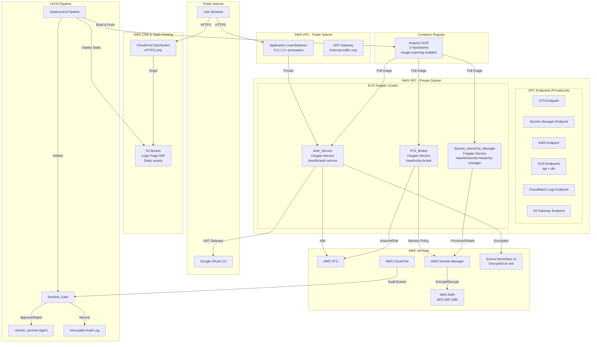
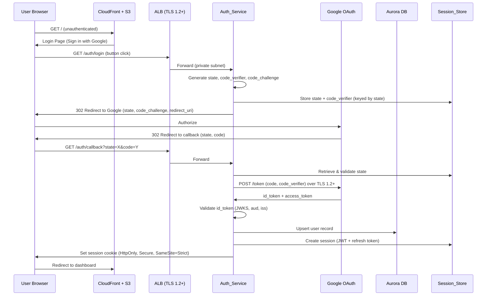
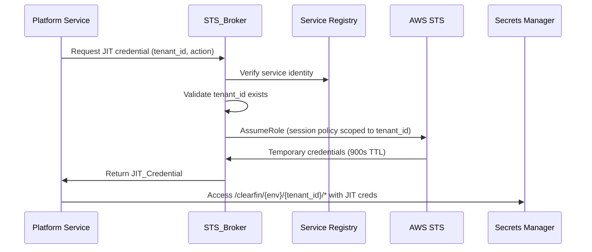

# Design Document: ClearFin Secure Foundation (Phase 1)

## Overview

ClearFin Secure Foundation establishes the security backbone for a multi-tenant fintech platform running on AWS in the `il-central-1` (Tel Aviv) region. This design covers eight interconnected components: a login page for user entry, Google SSO authentication with PKCE, JWT-based session management with rotating refresh tokens, AWS STS just-in-time credential issuance, a hierarchical Secrets Manager structure for tenant and platform secrets, a sentinel approval gate for deployment governance, infrastructure security baselines, and callback endpoint hardening.

The system follows a Zero Trust architecture where no component holds long-lived credentials, every access is scoped and audited, and cross-tenant isolation is enforced at the IAM policy level. All traffic to AWS services uses VPC PrivateLink endpoints; only external traffic (Google OAuth) traverses the NAT Gateway. The design targets PCI-DSS alignment and SOC2 readiness from day one.

### Key Design Decisions

1. **PKCE over implicit flow**: Authorization Code + PKCE prevents authorization code interception attacks, critical for a fintech platform.
2. **Refresh token rotation with family tracking**: Detects token replay by invalidating the entire token family when a consumed refresh token is reused.
3. **STS session policies over separate IAM roles per tenant**: A single base role with per-request session policies scales better than N roles for N tenants while maintaining strict isolation.
4. **Platform-level secret path (`_platform`)**: Separates shared infrastructure credentials (DB, AI keys) from tenant secrets, with distinct IAM policies preventing tenant JIT credentials from accessing platform secrets.
5. **Sentinel as a pipeline gate, not runtime middleware**: Approval happens at deployment time, not per-request, keeping runtime latency unaffected.
6. **Separate containers per service with ECR**: Each service (Auth_Service, STS_Broker, Secrets_Hierarchy_Manager) runs as an independent container image stored in its own Amazon ECR repository. This enables independent scaling, deployment, and versioning per service while maintaining clear blast-radius boundaries.
7. **VPC PrivateLink for all AWS service traffic**: All communication with AWS services (STS, Secrets Manager, KMS, ECR, CloudWatch Logs, CloudWatch Monitoring) uses VPC Interface Endpoints (PrivateLink). S3 uses a Gateway Endpoint. Only external traffic (Google OAuth) traverses the NAT Gateway. This eliminates AWS API traffic from the public internet path.

### Container & ECR Strategy

Each service is packaged as a separate Docker container image and pushed to a dedicated ECR repository:

| Service | ECR Repository | Fargate Service |
|---|---|---|
| Auth_Service | `clearfin/auth-service` | `clearfin-auth-service` |
| STS_Broker | `clearfin/sts-broker` | `clearfin-sts-broker` |
| Secrets_Hierarchy_Manager | `clearfin/secrets-hierarchy-manager` | `clearfin-secrets-hierarchy-manager` |

**ECR Configuration:**
- Image tag immutability enabled on all repositories to prevent tag overwriting
- Image scanning on push enabled for vulnerability detection
- Lifecycle policy: retain last 10 tagged images, expire untagged images after 7 days
- Encryption: AES-256 via KMS (same per-environment KMS_Key)
- Repository policy: restrict push access to the CI/CD pipeline role, pull access to the Fargate task execution roles only

**Container Build:**
- Multi-stage Dockerfile for minimal image size (build stage → production stage)
- Base image: Node.js Alpine (or equivalent minimal runtime)
- Non-root user execution inside containers
- No secrets baked into images — all secrets fetched at runtime from Secrets Manager via JIT credentials

## Architecture



    User -->|HTTPS| ALB
    ALB -->|Private| AuthService
    AuthService -->|NAT Gateway| Google
    AuthService -->|IAM| STS
    AuthService -->|Encrypted| Aurora
    STSBroker -->|AssumeRole| STS
    STSBroker -->|Session Policy| SM
    SecretsHM -->|Provision/Rotate| SM
    SM -->|Encrypt/Decrypt| KMS
    CT -->|Audit Events| SentinelGate
    Pipeline -->|Build & Push| ECR
    ECR -->|Pull Image| AuthService
    ECR -->|Pull Image| STSBroker
    ECR -->|Pull Image| SecretsHM
    Pipeline -->|Artifact| SentinelGate
    SentinelGate -->|Approve/Reject| Sentinel
    SentinelGate -->|Record| AuditLog
```

### Request Flow: Authentication



### Request Flow: JIT Credential Issuance



## Components and Interfaces

### Login_Page

Static single-page application served via CloudFront + S3 that provides the authentication entry point.

**Hosting:**
- Static assets (HTML, CSS, JS) deployed to an S3 bucket with public access blocked
- CloudFront distribution with HTTPS-only, OAC (Origin Access Control) for S3 access
- `Content-Security-Policy` header set via CloudFront response headers policy

**Behavior:**
- Displays ClearFin branding and a "Sign in with Google" button
- On click, redirects to Auth_Service `/auth/login` endpoint
- After successful OAuth callback, Auth_Service redirects back to the app with a session cookie; Login_Page detects the session and redirects to the dashboard
- On OAuth failure, displays a generic error message with a "Try again" link
- Responsive layout: 320px–1920px viewport support
- Keyboard navigable with WCAG 2.1 Level AA contrast ratios

### Auth_Service

Handles the complete Google SSO flow, session lifecycle, and user identity management.

**Endpoints:**

| Endpoint | Method | Auth Required | Description |
|---|---|---|---|
| `/auth/login` | GET | No | Initiates OAuth flow, generates state + PKCE params, redirects to Google |
| `/auth/callback` | GET | No | Processes Google callback, validates state/code, issues session |
| `/auth/refresh` | POST | Refresh Token | Rotates refresh token, issues new session JWT |
| `/auth/logout` | POST | Session JWT | Invalidates session and all associated tokens |
| `/health` | GET | No | Returns service health status for ALB health checks |

**Internal Interfaces:**

- `CallbackValidator.validate(state, code, redirectUri, sourceIp)` → `Result<AuthCode, CallbackError>`
- `TokenExchanger.exchange(code, codeVerifier)` → `Result<GoogleTokens, TokenError>`
- `IdTokenValidator.validate(idToken, expectedAud, expectedIss)` → `Result<UserClaims, ValidationError>`
- `SessionManager.createSession(userClaims, tenantId)` → `Result<SessionTokens, SessionError>`
- `SessionManager.refreshSession(refreshToken)` → `Result<SessionTokens, SessionError>`
- `SessionManager.revokeSession(sessionId)` → `Result<void, SessionError>`

### STS_Broker

Issues JIT credentials scoped to specific tenants and actions.

**Internal Interfaces:**

- `STSBroker.issueCredential(tenantId, serviceName, action)` → `Result<JITCredential, STSError>`
- `STSBroker.buildSessionPolicy(tenantId, action)` → `IAMSessionPolicy`
- `STSBroker.buildRoleSessionName(tenantId, serviceName)` → `string`

### Secrets_Hierarchy_Manager

Provisions and manages the Secrets Manager path hierarchy.

**Internal Interfaces:**

- `SecretsHierarchyManager.provisionTenant(tenantId, env)` → `Result<void, ProvisionError>`
- `SecretsHierarchyManager.provisionPlatformSecrets(env)` → `Result<void, ProvisionError>`
- `SecretsHierarchyManager.applyResourcePolicy(secretArn, policyDocument)` → `Result<void, PolicyError>`
- `SecretsHierarchyManager.enableRotation(secretArn, intervalDays)` → `Result<void, RotationError>`
- `SecretsHierarchyManager.tagSecret(secretArn, tags)` → `Result<void, TagError>`

### Sentinel_Gate

Deployment approval checkpoint integrated into the CI/CD pipeline.

**Internal Interfaces:**

- `SentinelGate.submitForApproval(artifact)` → `Result<ApprovalId, ValidationError>`
- `SentinelGate.validateArtifact(artifact)` → `Result<void, ArtifactValidationError>`
- `SentinelGate.recordDecision(approvalId, decision, approverIdentity)` → `void`
- `SentinelGate.triggerKillSwitch(deploymentId)` → `Result<void, KillSwitchError>`

### Callback_Validator

Subcomponent of Auth_Service focused on callback security.

**Internal Interfaces:**

- `CallbackValidator.checkRateLimit(sourceIp)` → `Result<void, RateLimitError>`
- `CallbackValidator.validateParameters(queryParams)` → `Result<ValidatedParams, ValidationError>`
- `CallbackValidator.checkBruteForce(sourceIp)` → `Result<void, BruteForceError>`
- `CallbackValidator.buildSecurityHeaders()` → `HttpHeaders`


## Data Models

### User Record

```typescript
interface UserRecord {
  id: string;                    // Platform-generated UUID
  googleSubjectId: string;       // Google 'sub' claim (immutable)
  email: string;                 // From id_token
  name: string;                  // From id_token
  tenantId: string;              // Associated tenant
  createdAt: Date;
  updatedAt: Date;
  lastLoginAt: Date;
}
```

### Session Token (JWT Payload)

```typescript
interface SessionTokenPayload {
  sub: string;                   // User subject ID
  tenantId: string;              // Tenant_ID (Req 2.6)
  iat: number;                   // Issued-at timestamp (Req 2.6)
  exp: number;                   // Expiration (iat + 15 minutes)
  jti: string;                   // Unique token ID
  tokenFamily: string;           // Family ID for rotation tracking
}
```

### Refresh Token Record

```typescript
interface RefreshTokenRecord {
  id: string;                    // Unique refresh token ID
  tokenFamily: string;           // Links to session token family
  userId: string;
  tenantId: string;
  issuedAt: Date;
  expiresAt: Date;               // issuedAt + 8 hours
  consumed: boolean;             // Set true on use (Req 2.4)
  revokedAt: Date | null;        // Set on family revocation (Req 2.5)
}
```

### JIT Credential

```typescript
interface JITCredential {
  accessKeyId: string;
  secretAccessKey: string;
  sessionToken: string;
  expiration: Date;              // Max 900 seconds from issuance
  tenantId: string;
  serviceName: string;
  roleSessionName: string;       // Format: {tenantId}-{serviceName}
}
```

### Session Policy (STS)

```typescript
interface STSSessionPolicy {
  Version: "2012-10-17";
  Statement: [{
    Effect: "Allow";
    Action: string[];            // Scoped actions (e.g., secretsmanager:GetSecretValue)
    Resource: string;            // arn:aws:secretsmanager:{region}:{account}:secret:/clearfin/{env}/{tenantId}/*
  }];
}
```

### Secret Metadata Tags

```typescript
interface SecretTags {
  tenant_id: string;             // Tenant ID or "_platform"
  environment: string;           // dev, staging, prod
  secret_type: string;           // bank-credentials, api-keys, config, database-credentials, ai-api-keys, service-config
  created_by: string;            // Identity of creator
}
```

### Sentinel Audit Record

```typescript
interface SentinelAuditRecord {
  id: string;
  artifactHash: string;          // SHA-256 of deployment artifact
  decision: "approved" | "rejected";
  approverIdentity: string;      // clearfin_sentinel identity
  reason: string | null;         // Rejection reason
  timestamp: Date;
  artifactContents: {
    iamPolicies: boolean;
    stsTrustPolicies: boolean;
    secretsManagerPolicies: boolean;
  };
}
```

### Rate Limit State

```typescript
interface RateLimitEntry {
  sourceIp: string;
  windowStart: Date;
  requestCount: number;          // Max 10 per 60s window
  consecutiveFailures: number;   // 5 failures in 5 min → 15 min block
  blockedUntil: Date | null;
}
```

### Tenant Secret Paths

```
Tenant-scoped:
  /clearfin/{env}/{tenant_id}/bank-credentials
  /clearfin/{env}/{tenant_id}/api-keys
  /clearfin/{env}/{tenant_id}/config

Platform-level:
  /clearfin/{env}/_platform/database-credentials
  /clearfin/{env}/_platform/ai-api-keys
  /clearfin/{env}/_platform/service-config
```


## Correctness Properties

*A property is a characteristic or behavior that should hold true across all valid executions of a system — essentially, a formal statement about what the system should do. Properties serve as the bridge between human-readable specifications and machine-verifiable correctness guarantees.*

### Property 1: OAuth Redirect URL Construction

*For any* cryptographically random state value and PKCE code_verifier, the login initiation function SHALL produce a redirect URL that contains the `state` parameter, a `code_challenge` derived from the code_verifier, and a `redirect_uri` matching one of the registered URIs.

**Validates: Requirements 1.1**

### Property 2: State Parameter Matching

*For any* pair of state values (stored vs returned), the Callback_Validator SHALL accept the callback if and only if the two state values are identical; all non-matching or missing state values SHALL be rejected.

**Validates: Requirements 1.2, 1.3**

### Property 3: id_token Claim Validation

*For any* id_token, the Auth_Service SHALL accept the token if and only if the signature is valid against Google's JWKS, the `aud` claim matches the registered client ID, and the `iss` claim matches `https://accounts.google.com`. Any token failing any of these checks SHALL be rejected.

**Validates: Requirements 1.5, 1.6**

### Property 4: User Info Extraction from id_token

*For any* valid id_token containing email, name, and subject claims, the Auth_Service extraction function SHALL return a user record where the email, name, and googleSubjectId fields exactly match the corresponding token claims.

**Validates: Requirements 1.7**

### Property 5: Redirect URI Allowlist Validation

*For any* redirect_uri and allowlist of registered URIs, the Auth_Service SHALL accept the URI if and only if it exactly matches an entry in the allowlist; all non-matching URIs SHALL be rejected.

**Validates: Requirements 1.8**

### Property 6: Session Token Construction

*For any* authenticated user with a tenantId and subject ID, the issued session JWT SHALL contain the `tenantId`, `sub` (user subject ID), and `iat` (issued-at timestamp) fields, with `exp` equal to `iat + 900 seconds` (15 minutes), and the accompanying refresh token SHALL have an expiration of `iat + 28800 seconds` (8 hours).

**Validates: Requirements 2.1, 2.6**

### Property 7: Refresh Token Rotation

*For any* valid refresh token that is consumed during a refresh operation, the Auth_Service SHALL mark the original token as consumed and issue a new refresh token with a new ID but the same token family, such that the original token is no longer usable.

**Validates: Requirements 2.4**

### Property 8: Token Family Revocation on Replay

*For any* token family with N rotations, if a previously consumed refresh token is presented, the Auth_Service SHALL revoke all tokens in that token family (both consumed and active) and terminate the associated session.

**Validates: Requirements 2.5**

### Property 9: STS Request Construction

*For any* tenant_id, service name, and requested action, the STS_Broker SHALL construct an AssumeRole request where: (a) the session policy `Resource` field matches exactly `arn:aws:secretsmanager:*:*:secret:/clearfin/{env}/{tenantId}/*`, and (b) the `RoleSessionName` contains both the tenant_id and the service name.

**Validates: Requirements 3.1, 3.3, 3.7**

### Property 10: Service Identity Verification

*For any* service name, the STS_Broker SHALL issue a JIT_Credential if and only if the service name exists in the platform's service registry; all unregistered service names SHALL be rejected.

**Validates: Requirements 3.5**

### Property 11: Non-Existent Tenant Rejection

*For any* tenant_id that does not exist in the platform database, the STS_Broker SHALL reject the JIT_Credential request and log a security alert containing the requested tenant_id.

**Validates: Requirements 3.6**

### Property 12: Secret Path Construction

*For any* tenant_id and environment, the Secrets_Hierarchy_Manager SHALL produce exactly three tenant paths (`/clearfin/{env}/{tenant_id}/bank-credentials`, `/clearfin/{env}/{tenant_id}/api-keys`, `/clearfin/{env}/{tenant_id}/config`). *For any* environment, it SHALL produce exactly three platform paths (`/clearfin/{env}/_platform/database-credentials`, `/clearfin/{env}/_platform/ai-api-keys`, `/clearfin/{env}/_platform/service-config`).

**Validates: Requirements 4.1, 4.7**

### Property 13: Tenant Resource Policy Construction

*For any* tenant_id, the resource policy generated by the Secrets_Hierarchy_Manager SHALL contain an `aws:PrincipalTag/tenant_id` condition that matches only the specified tenant_id.

**Validates: Requirements 4.2**

### Property 14: Cross-Tenant Access Denial

*For any* pair of tenant IDs where the path tenant_id differs from the caller's session tenant_id, the Secrets_Hierarchy_Manager SHALL deny the access request.

**Validates: Requirements 4.5**

### Property 15: Secret Metadata Tagging

*For any* secret created by the Secrets_Hierarchy_Manager, the tags SHALL include `tenant_id` (or `_platform`), `environment`, `secret_type`, and `created_by`, and each tag value SHALL match the corresponding input parameter.

**Validates: Requirements 4.6**

### Property 16: Platform Resource Policy Construction

*For any* set of platform service role ARNs, the resource policy for platform-level secrets SHALL allow access only to those roles and SHALL contain an explicit deny for principals with a `tenant_id` tag (tenant-scoped JIT_Credentials).

**Validates: Requirements 4.8**

### Property 17: Deployment Artifact Validation

*For any* deployment artifact, the Sentinel_Gate SHALL accept the artifact as complete if and only if it contains IAM policy documents, STS trust policies, and Secrets Manager resource policies; any artifact missing one or more of these SHALL be rejected.

**Validates: Requirements 5.2**

### Property 18: Audit Record Construction

*For any* approval or rejection decision, the Sentinel_Gate SHALL produce an audit record containing a timestamp, the SHA-256 artifact hash, and the approver identity, with no fields missing or null (except `reason` which may be null for approvals).

**Validates: Requirements 5.5**

### Property 19: Callback Rate Limiting

*For any* source IP address, the Callback_Validator SHALL allow up to 10 requests within a 60-second window and return HTTP 429 for every subsequent request within that window.

**Validates: Requirements 7.1**

### Property 20: Callback Input Validation

*For any* callback request, the Callback_Validator SHALL reject the request if: (a) the `code` parameter exceeds 2048 characters, (b) the `code` parameter contains non-URL-safe characters, or (c) the query parameters include any key not in the set {`state`, `code`, `scope`, `authuser`}. All requests meeting all three criteria SHALL be accepted.

**Validates: Requirements 7.2, 7.3**

### Property 21: Brute-Force Detection and Blocking

*For any* source IP address, if 5 consecutive callback validations fail within a 5-minute window, the Callback_Validator SHALL block that IP for 15 minutes and log a brute-force alert. Non-consecutive failures (interrupted by a success) SHALL NOT trigger blocking.

**Validates: Requirements 7.4**


## Error Handling

### Auth_Service Errors

| Error Condition | HTTP Status | Response | Logging |
|---|---|---|---|
| State mismatch/missing on callback | 403 Forbidden | `{ "error": "invalid_state" }` | WARN: source IP, expected vs received state hash |
| id_token validation failure (sig, aud, iss) | 401 Unauthorized | `{ "error": "invalid_token", "reason": "<claim>" }` | WARN: failure reason, token issuer |
| Redirect URI not in allowlist | 403 Forbidden | `{ "error": "invalid_redirect_uri" }` | WARN: attempted URI, source IP |
| Google token exchange failure | 502 Bad Gateway | `{ "error": "token_exchange_failed" }` | ERROR: Google error response, correlation ID |
| Expired session JWT | 401 Unauthorized | `{ "error": "token_expired" }` | INFO: token jti, expiration time |
| Invalid/consumed refresh token | 401 Unauthorized | `{ "error": "invalid_refresh_token" }` | WARN: token family ID, consumed status |
| Replay of consumed refresh token | 401 Unauthorized | `{ "error": "token_replay_detected" }` | CRITICAL: token family ID, all revoked token IDs |
| Rate limit exceeded (callback) | 429 Too Many Requests | `{ "error": "rate_limit_exceeded" }` | WARN: source IP, request count, window |
| IP blocked (brute-force) | 429 Too Many Requests | `{ "error": "ip_blocked" }` | ALERT: source IP, failure count, block duration |
| Invalid callback parameters | 400 Bad Request | `{ "error": "invalid_parameters" }` | WARN: parameter names, validation failures |

### STS_Broker Errors

| Error Condition | Response | Logging |
|---|---|---|
| Unverified service identity | Structured error: `SERVICE_NOT_REGISTERED` | WARN: service name, request source |
| Non-existent tenant_id | Structured error: `TENANT_NOT_FOUND` | ALERT: requested tenant_id, service name |
| STS AssumeRole failure | Structured error: `STS_ASSUME_ROLE_FAILED` | ERROR: role ARN, tenant_id, AWS error code |

### Secrets_Hierarchy_Manager Errors

| Error Condition | Response | Logging |
|---|---|---|
| Cross-tenant access attempt | Deny + structured error | CRITICAL: path tenant_id, caller tenant_id, caller session name |
| Secret provisioning failure | Structured error: `PROVISION_FAILED` | ERROR: secret path, AWS error |
| Rotation configuration failure | Structured error: `ROTATION_CONFIG_FAILED` | ERROR: secret ARN, rotation interval |
| KMS encryption failure | Structured error: `KMS_ENCRYPTION_FAILED` | ERROR: KMS key ARN, secret path |

### Sentinel_Gate Errors

| Error Condition | Response | Logging |
|---|---|---|
| Incomplete artifact (missing policies) | Rejection with missing components list | WARN: artifact hash, missing components |
| Deployment bypass detected | Kill-switch triggered | CRITICAL: deployment ID, revoked resources |
| Approval timeout | Pipeline halt | WARN: artifact hash, wait duration |

### Error Handling Principles

1. **Never expose internal details**: Error responses to clients contain error codes, not stack traces or internal paths.
2. **Structured logging**: All errors logged as structured JSON with correlation IDs for traceability.
3. **Security events escalation**: Cross-tenant access, token replay, and deployment bypass trigger CRITICAL-level alerts routed to the security operations channel.
4. **Fail closed**: All security-sensitive operations (STS credential issuance, secret access, deployment promotion) default to deny on any error.

## Testing Strategy

### Unit Tests

Unit tests cover specific examples, edge cases, and error conditions for each component:

- **Auth_Service**: Login redirect construction, callback validation (valid/invalid state, missing params), id_token validation with known-good and known-bad tokens, user record extraction, redirect URI allowlist matching, session creation with specific claims.
- **Session Management**: JWT creation with known timestamps, refresh token rotation with specific token IDs, token family revocation with a 3-rotation chain, logout invalidation.
- **STS_Broker**: Session policy construction for specific tenant/action pairs, RoleSessionName formatting, service registry lookup (registered/unregistered), tenant existence check.
- **Secrets_Hierarchy_Manager**: Path construction for specific tenant IDs and environments, resource policy generation for tenant and platform secrets, tag construction, cross-tenant access denial with specific tenant pairs.
- **Sentinel_Gate**: Artifact validation with complete/incomplete artifacts, audit record creation for approval/rejection, kill-switch trigger.
- **Callback_Validator**: Rate limit at boundary (10th and 11th request), brute-force detection at boundary (4th and 5th failure), code parameter validation with edge-case lengths (2048, 2049), security header presence.

### Property-Based Tests

Property-based tests validate universal properties across generated inputs. Each property test runs a minimum of 100 iterations.

**Library**: `fast-check` (TypeScript/JavaScript) or equivalent PBT library for the chosen runtime.

**Property tests to implement** (each references a design property):

| Property | Tag | Generator Strategy |
|---|---|---|
| P1: OAuth Redirect URL | `Feature: clearfin-secure-foundation, Property 1` | Random alphanumeric state values, random code_verifiers |
| P2: State Matching | `Feature: clearfin-secure-foundation, Property 2` | Random string pairs (matching and non-matching) |
| P3: id_token Validation | `Feature: clearfin-secure-foundation, Property 3` | Random JWTs with valid/invalid signatures, aud, iss combinations |
| P4: User Info Extraction | `Feature: clearfin-secure-foundation, Property 4` | Random email/name/subject claim combinations |
| P5: Redirect URI Allowlist | `Feature: clearfin-secure-foundation, Property 5` | Random URIs and random allowlists |
| P6: Session Token Construction | `Feature: clearfin-secure-foundation, Property 6` | Random user claims, tenant IDs, timestamps |
| P7: Refresh Token Rotation | `Feature: clearfin-secure-foundation, Property 7` | Random token IDs and family IDs |
| P8: Token Family Revocation | `Feature: clearfin-secure-foundation, Property 8` | Random token families with 1-10 rotations, replay at random position |
| P9: STS Request Construction | `Feature: clearfin-secure-foundation, Property 9` | Random tenant IDs, service names, action strings |
| P10: Service Identity Verification | `Feature: clearfin-secure-foundation, Property 10` | Random service names against random registries |
| P11: Non-Existent Tenant Rejection | `Feature: clearfin-secure-foundation, Property 11` | Random tenant IDs against random valid tenant sets |
| P12: Secret Path Construction | `Feature: clearfin-secure-foundation, Property 12` | Random tenant IDs and environment names |
| P13: Tenant Resource Policy | `Feature: clearfin-secure-foundation, Property 13` | Random tenant IDs |
| P14: Cross-Tenant Access Denial | `Feature: clearfin-secure-foundation, Property 14` | Random tenant ID pairs (same and different) |
| P15: Secret Metadata Tagging | `Feature: clearfin-secure-foundation, Property 15` | Random tenant IDs, environments, secret types, creator identities |
| P16: Platform Resource Policy | `Feature: clearfin-secure-foundation, Property 16` | Random sets of platform role ARNs |
| P17: Artifact Validation | `Feature: clearfin-secure-foundation, Property 17` | Random artifacts with subsets of required policy types |
| P18: Audit Record Construction | `Feature: clearfin-secure-foundation, Property 18` | Random decisions, artifact hashes, approver identities |
| P19: Rate Limiting | `Feature: clearfin-secure-foundation, Property 19` | Random request counts (1-20) per IP within a window |
| P20: Callback Input Validation | `Feature: clearfin-secure-foundation, Property 20` | Random code strings (varying length, character sets), random query param sets |
| P21: Brute-Force Detection | `Feature: clearfin-secure-foundation, Property 21` | Random sequences of pass/fail validations per IP |

### Integration Tests

Integration tests verify AWS service interactions and end-to-end flows with 1-3 representative examples each:

- **Google OAuth flow**: Mock Google endpoints, verify full login → callback → session creation flow.
- **STS AssumeRole**: Verify actual STS call with scoped session policy returns credentials with correct permissions.
- **Secrets Manager provisioning**: Verify secrets are created at correct paths with correct encryption and rotation config.
- **CloudTrail audit events**: Verify IAM/STS/SM policy modifications generate audit events.
- **Session logout**: Verify tokens are invalidated within the 1-second SLA.

### Smoke Tests

Single-execution checks for infrastructure configuration:

- Fargate tasks in private subnets with no public IP (Req 6.1)
- NAT Gateway routing for outbound traffic (Req 6.2)
- TLS 1.2 minimum enforcement (Req 6.3)
- KMS encryption enabled on Session_Store (Req 2.2)
- KMS encryption on Secrets Manager (Req 4.3)
- `/health` endpoint accessible without auth (Req 6.6)
