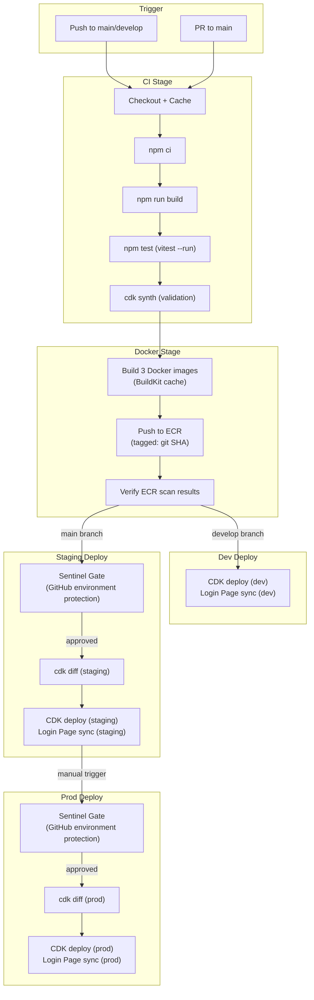
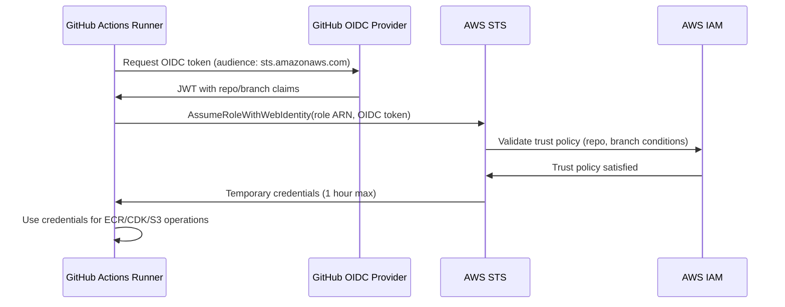
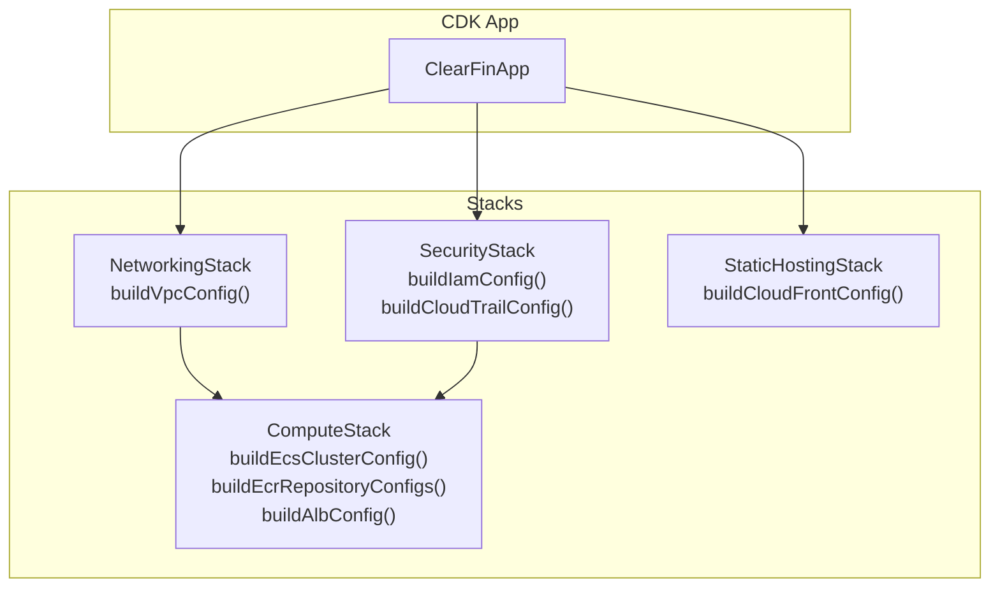

# Design Document: GitHub Actions Deployment Pipeline

## Overview

This design defines the CI/CD pipeline for ClearFin Secure Foundation using GitHub Actions and AWS CDK. The pipeline replaces the existing CodePipeline/CodeBuild references in `packages/infra/src/pipeline.ts` with GitHub Actions workflows that orchestrate build, test, Docker image creation, infrastructure deployment, and Login Page deployment across three environments (dev, staging, prod) in the `il-central-1` (Tel Aviv) region.

### Key Design Decisions

1. **GitHub Actions over CodePipeline**: GitHub Actions provides native OIDC federation, environment protection rules (for Sentinel Gate), and tight integration with the GitHub repository. The existing `pipeline.ts` config objects are adapted into CDK stacks rather than CodePipeline constructs.
2. **Single workflow file with reusable jobs**: One primary workflow (`deploy.yml`) handles the full pipeline with conditional job execution based on branch. A separate `bootstrap.yml` handles CDK bootstrap. This avoids workflow sprawl while keeping the logic readable.
3. **OIDC federation with per-environment IAM roles**: Each environment (dev, staging, prod) has its own IAM role with branch-scoped trust conditions. No long-lived AWS credentials exist anywhere in GitHub.
4. **GitHub environment protection rules for Sentinel Gate**: Staging and prod environments use GitHub's built-in environment protection rules with required reviewers, mapping directly to the Sentinel Gate approval flow. This avoids building custom approval infrastructure.
5. **CDK stacks organized by concern**: Four logical stacks (networking, compute, security, static-hosting) consume the existing `build*Config` functions. This keeps blast radius small and allows independent stack updates.
6. **Immutable Docker tags via git SHA**: Every image is tagged with the short git commit SHA, ensuring traceability and preventing tag mutation. ECR immutable tag policy enforces this at the registry level.

### Workflow Files

| File | Trigger | Purpose |
|---|---|---|
| `.github/workflows/deploy.yml` | Push to `main`/`develop`, PR to `main` | Full CI/CD: build, test, Docker, CDK deploy, Login Page |
| `.github/workflows/bootstrap.yml` | Manual (`workflow_dispatch`) | CDK bootstrap for new environments |

## Architecture

### Pipeline Flow



### OIDC Authentication Flow



### CDK Stack Organization



## Components and Interfaces

### GitHub Actions Workflow: `deploy.yml`

The primary workflow with the following jobs:

**Job: `build-and-test`**
- Runs on: `ubuntu-latest`
- Triggers: push to `main`/`develop`, PR to `main`
- Steps: checkout, setup Node 22, cache `node_modules` (keyed on `package-lock.json` hash), `npm ci`, `npm run build`, `npm test` (vitest --run)
- Permissions: `contents: read`

**Job: `docker-build-push`**
- Runs on: `ubuntu-latest`
- Needs: `build-and-test`
- Condition: push event only (not PRs)
- Steps: checkout, configure AWS credentials (OIDC), ECR login, build 3 images with BuildKit cache, push to ECR, verify scan results
- Permissions: `contents: read`, `id-token: write`

**Job: `cdk-synth`**
- Runs on: `ubuntu-latest`
- Needs: `build-and-test`
- Condition: push event only
- Steps: checkout, setup Node 22, `npm ci`, `npm run build`, `cdk synth`, upload `cdk.out` as artifact
- Permissions: `contents: read`, `id-token: write`

**Job: `deploy-dev`**
- Runs on: `ubuntu-latest`
- Needs: `docker-build-push`, `cdk-synth`
- Condition: `github.ref == 'refs/heads/develop'`
- Environment: `dev`
- Steps: configure AWS (OIDC, dev role), download `cdk.out`, `cdk diff`, `cdk deploy --require-approval never`, build Login Page, `aws s3 sync`, CloudFront invalidation
- Permissions: `contents: read`, `id-token: write`

**Job: `deploy-staging`**
- Runs on: `ubuntu-latest`
- Needs: `docker-build-push`, `cdk-synth`
- Condition: `github.ref == 'refs/heads/main'`
- Environment: `staging` (with protection rules → Sentinel Gate)
- Steps: same as dev deploy but targeting staging account/role
- Permissions: `contents: read`, `id-token: write`

**Job: `deploy-prod`**
- Runs on: `ubuntu-latest`
- Needs: `deploy-staging`
- Condition: `github.ref == 'refs/heads/main'`
- Environment: `prod` (with protection rules → Sentinel Gate)
- Steps: same as staging deploy but targeting prod account/role
- Permissions: `contents: read`, `id-token: write`

**Job: `summary`**
- Runs on: `ubuntu-latest`
- Needs: all deploy jobs
- Condition: `always()`
- Steps: generate workflow run summary (git SHA, image tags, stacks deployed, sentinel status, duration)
- Permissions: `contents: read`

### GitHub Actions Workflow: `bootstrap.yml`

Manual workflow for CDK bootstrap:

- Trigger: `workflow_dispatch` with `environment` input (dev/staging/prod)
- Steps: configure AWS (OIDC), `cdk bootstrap aws://{account}/{region}` with CDK qualifier
- Permissions: `contents: read`, `id-token: write`

### CDK Stack Definitions

New file: `packages/infra/src/cdk/` directory containing CDK stack classes.

**`ClearFinNetworkingStack`**
- Consumes: `buildVpcConfig(env)`
- Creates: VPC, subnets (public + private), NAT Gateways, route tables, VPC PrivateLink endpoints (ECR API, ECR DKR, STS, Secrets Manager, KMS, CloudWatch Logs, CloudWatch Monitoring) and S3 Gateway endpoint
- Exports: VPC ID, private subnet IDs, public subnet IDs

**`ClearFinComputeStack`**
- Consumes: `buildEcsClusterConfig(env)`, `buildEcrRepositoryConfigs(env)`, `buildAlbConfig(env, certArn)`
- Creates: ECS Fargate cluster, 3 Fargate services (with image tag from context), ECR repositories, ALB with TLS termination, target groups
- Depends on: NetworkingStack (VPC, subnets), SecurityStack (IAM roles)

**`ClearFinSecurityStack`**
- Consumes: `buildIamConfig(env, accountId, region)`, `buildCloudTrailConfig(env, accountId, region)`
- Creates: KMS keys, IAM roles (task execution, task, STS base), CloudTrail trail, EventBridge rules
- Exports: role ARNs, KMS key ARNs

**`ClearFinStaticHostingStack`**
- Consumes: `buildCloudFrontConfig(env, appOrigin)`
- Creates: S3 bucket (login page), CloudFront distribution with OAC, response headers policy
- Exports: S3 bucket name, CloudFront distribution ID

### OIDC Trust Policy Configuration

Each environment has a dedicated IAM role with an OIDC trust policy:

```json
{
  "Version": "2012-10-17",
  "Statement": [
    {
      "Effect": "Allow",
      "Principal": {
        "Federated": "arn:aws:iam::{ACCOUNT_ID}:oidc-provider/token.actions.githubusercontent.com"
      },
      "Action": "sts:AssumeRoleWithWebIdentity",
      "Condition": {
        "StringEquals": {
          "token.actions.githubusercontent.com:aud": "sts.amazonaws.com"
        },
        "StringLike": {
          "token.actions.githubusercontent.com:sub": "repo:{ORG}/{REPO}:ref:refs/heads/{BRANCH_PATTERN}"
        }
      }
    }
  ]
}
```

Branch restrictions per environment:

| Environment | Allowed Branches | IAM Role |
|---|---|---|
| dev | `main`, `develop` | `clearfin-dev-github-actions-deploy` |
| staging | `main` | `clearfin-staging-github-actions-deploy` |
| prod | `main` | `clearfin-prod-github-actions-deploy` |

### IAM Role Permissions (per environment)

Each OIDC-assumed role has scoped permissions for its deployment stage:

- **ECR permissions**: `ecr:GetAuthorizationToken`, `ecr:BatchCheckLayerAvailability`, `ecr:PutImage`, `ecr:InitiateLayerUpload`, `ecr:UploadLayerPart`, `ecr:CompleteLayerUpload`, `ecr:DescribeImageScanFindings`
- **CDK deploy permissions**: `cloudformation:*` (scoped to `clearfin-*` stacks), `sts:AssumeRole` (CDK execution roles), `ssm:GetParameter` (CDK bootstrap version)
- **S3 permissions**: `s3:PutObject`, `s3:DeleteObject`, `s3:ListBucket` (scoped to `clearfin-{env}-login-page`)
- **CloudFront permissions**: `cloudfront:CreateInvalidation` (scoped to distribution)

### GitHub Environment Configuration

| Environment | Protection Rules | Variables |
|---|---|---|
| `dev` | None (auto-deploy) | `AWS_ACCOUNT_ID`, `AWS_REGION`, `AWS_ROLE_ARN`, `DOMAIN_NAME`, `CERTIFICATE_ARN` |
| `staging` | Required reviewer: `clearfin_sentinel`, 60-min timeout | Same variable set |
| `prod` | Required reviewer: `clearfin_sentinel`, 60-min timeout | Same variable set |

### Artifact Bundle Summary

Before Sentinel Gate approval, the pipeline generates a summary artifact containing:
- List of IAM policy documents from `cdk synth` output
- STS trust policy statements
- Secrets Manager resource policies
- CDK diff output
- Docker image tags and ECR scan results

This is attached to the GitHub deployment review as a comment/artifact for `clearfin_sentinel` to review.

### Docker Build Strategy

Each service image is built using the existing multi-stage Dockerfiles:

```yaml
# Matrix strategy for parallel builds
strategy:
  matrix:
    service:
      - name: auth-service
        dockerfile: packages/auth-service/Dockerfile
        ecr-repo: clearfin/auth-service
      - name: sts-broker
        dockerfile: packages/sts-broker/Dockerfile
        ecr-repo: clearfin/sts-broker
      - name: secrets-hierarchy-manager
        dockerfile: packages/secrets-hierarchy-manager/Dockerfile
        ecr-repo: clearfin/secrets-hierarchy-manager
```

- BuildKit cache: `type=gha` (GitHub Actions cache backend)
- Tag: `${ECR_REGISTRY}/${ECR_REPO}:${GITHUB_SHA::7}` (short SHA)
- Context: repository root (required for workspace `COPY` in Dockerfiles)

### Login Page Deployment Strategy

After CDK infrastructure deployment:

1. Build Login Page: `npm run build --workspace=packages/login-page`
2. Sync to S3 with cache headers:
   - `index.html`: `Cache-Control: no-cache` (always fresh)
   - Hashed assets (`*.js`, `*.css` with content hash): `Cache-Control: max-age=31536000, immutable`
3. CloudFront invalidation: `aws cloudfront create-invalidation --distribution-id $DIST_ID --paths "/*"`

### Third-Party Action Pinning

All third-party actions pinned to commit SHAs:

| Action | Purpose | Pinned SHA |
|---|---|---|
| `actions/checkout` | Repository checkout | Pinned to specific commit SHA |
| `actions/setup-node` | Node.js setup | Pinned to specific commit SHA |
| `actions/cache` | Dependency caching | Pinned to specific commit SHA |
| `aws-actions/configure-aws-credentials` | OIDC AWS auth | Pinned to specific commit SHA |
| `aws-actions/amazon-ecr-login` | ECR authentication | Pinned to specific commit SHA |
| `docker/setup-buildx-action` | BuildKit setup | Pinned to specific commit SHA |
| `docker/build-push-action` | Docker build + push | Pinned to specific commit SHA |

## Data Models

### Pipeline Environment Configuration

```typescript
interface PipelineEnvironmentConfig {
  name: 'dev' | 'staging' | 'prod';
  awsAccountId: string;
  awsRegion: string;
  iamRoleArn: string;
  domainName: string;
  certificateArn: string;
  branch: string;              // 'develop' for dev, 'main' for staging/prod
  requiresSentinelApproval: boolean;
  cdkStacks: string[];         // Stack names to deploy
}
```

### OIDC Provider Configuration

```typescript
interface OidcProviderConfig {
  issuerUrl: 'https://token.actions.githubusercontent.com';
  audience: 'sts.amazonaws.com';
  thumbprint: string;          // GitHub OIDC thumbprint
}
```

### OIDC Role Trust Policy

```typescript
interface OidcRoleTrustPolicy {
  roleName: string;
  environment: string;
  allowedBranches: string[];   // Branch patterns for sub claim
  permissions: {
    ecr: boolean;
    cdkDeploy: boolean;
    s3Sync: boolean;
    cloudFrontInvalidation: boolean;
  };
}
```

### CDK Stack Parameters

```typescript
interface CdkStackContext {
  environment: string;
  accountId: string;
  region: string;
  imageTag: string;            // Git SHA for Docker image references
  domainName: string;
  certificateArn: string;
}
```

### Deployment Summary Record

```typescript
interface DeploymentSummary {
  gitCommitSha: string;
  dockerImageTags: Record<string, string>;  // service -> tag
  cdkStacksDeployed: string[];
  sentinelApprovalStatus: 'approved' | 'not-required' | 'rejected' | 'timeout';
  deploymentDuration: number;  // seconds
  environment: string;
  timestamp: Date;
}
```


## Correctness Properties

*A property is a characteristic or behavior that should hold true across all valid executions of a system — essentially, a formal statement about what the system should do. Properties serve as the bridge between human-readable specifications and machine-verifiable correctness guarantees.*

Note: This feature is primarily CI/CD pipeline configuration (GitHub Actions YAML) and Infrastructure as Code (CDK stacks). Most acceptance criteria are configuration/smoke checks that don't benefit from property-based testing. However, several helper functions that the pipeline relies on DO have pure input/output behavior suitable for PBT.

### Property 1: OIDC Trust Policy Branch Restrictions

*For any* environment name (dev, staging, prod), the generated OIDC trust policy SHALL contain `StringLike` conditions on `token.actions.githubusercontent.com:sub` that allow exactly the correct branch patterns for that environment (dev: `main` and `develop`; staging: `main` only; prod: `main` only) and no other branches.

**Validates: Requirements 1.3**

### Property 2: Artifact Bundle Summary Extraction

*For any* CDK synthesized CloudFormation template set containing IAM policy documents, STS trust policies, and/or Secrets Manager resource policies, the artifact summary extraction function SHALL identify and categorize every policy document present, and SHALL report a component as missing if and only if no policies of that type exist in the input.

**Validates: Requirements 5.3**

### Property 3: Cache-Control Header Selection

*For any* filename, the cache header selection function SHALL return `Cache-Control: no-cache` for `index.html` and `Cache-Control: max-age=31536000, immutable` for all other files (hashed assets). No filename SHALL receive an empty or undefined Cache-Control value.

**Validates: Requirements 6.3**

### Property 4: Deployment Summary Completeness

*For any* valid deployment summary input (git SHA, image tags map, stack names list, sentinel status, duration), the generated summary string SHALL contain the git commit SHA, every Docker image tag, every CDK stack name, the sentinel approval status, and the deployment duration. No required field SHALL be absent from the output.

**Validates: Requirements 9.4**

### Property 5: Third-Party Action SHA Pinning

*For any* `uses:` reference to a third-party GitHub Action (not `actions/` org-owned or local actions) in the workflow YAML, the version specifier SHALL be a 40-character hexadecimal string (commit SHA), not a mutable tag (e.g., `v4`, `latest`, `main`).

**Validates: Requirements 9.1**

### Property 6: Image Tag Consistency Across Environments

*For any* set of deploy jobs within a single workflow run, all jobs SHALL reference Docker image tags derived from the same git commit SHA. The image tag used for ECR push SHALL equal the image tag used in CDK context for every deploy job.

**Validates: Requirements 7.5**

## Error Handling

### Workflow-Level Errors

| Error Condition | Behavior | Reporting |
|---|---|---|
| OIDC token exchange failure | Workflow terminates immediately | Error message with target role ARN in job output |
| `npm ci` failure | Build job fails, all downstream jobs skipped | npm error output in job logs |
| TypeScript build failure | Build job fails, all downstream jobs skipped | `tsc` error output in job logs |
| Test failure (any of 333 tests) | Build job fails, all downstream jobs skipped | vitest output with failed test details |
| `cdk synth` failure | Synth job fails, deploy jobs skipped | CDK synthesis error in job logs |
| Docker build failure | Docker job fails for that matrix entry, deploy jobs skipped | BuildKit error output, identifies which service failed |
| ECR push failure | Docker job fails, deploy jobs skipped | ECR error with repository name and image tag |
| ECR scan: CRITICAL/HIGH vulnerabilities | Reported as workflow annotations (warning) | Vulnerability count and severity in job summary |
| `cdk diff` failure | Deploy job fails | CDK diff error in job logs |
| `cdk deploy` failure | Deploy job fails, downstream environments skipped | CloudFormation error events in job logs, stack left in rollback-capable state |
| S3 sync failure | Deploy job fails | AWS CLI error with bucket name and failed file |
| CloudFront invalidation failure | Deploy job fails | Invalidation error with distribution ID |
| Sentinel Gate timeout (60 min) | Deploy job cancelled | Timeout event in workflow summary |
| Sentinel Gate rejection | Deploy job fails, downstream environments skipped | Rejection logged in workflow summary with approver identity |

### Error Handling Principles

1. **Fail fast**: Any failure in the CI stage prevents all deployment stages from executing.
2. **No partial deployments**: If CDK deploy fails, the stack is left in a rollback-capable state — no manual cleanup required.
3. **Clear attribution**: Every error message identifies the specific component, environment, and step that failed.
4. **No credential leakage**: AWS credentials, session tokens, and sensitive config values are never printed to logs. GitHub Actions masking is used for all secret values.
5. **Promotion blocking**: A failure in any environment prevents automatic promotion to subsequent environments via job dependency chains.

## Testing Strategy

### Unit Tests

Unit tests cover specific examples and edge cases for the pipeline helper functions:

- **OIDC trust policy generation**: Verify correct branch patterns for each environment (dev, staging, prod). Verify the trust policy structure matches AWS IAM format.
- **CDK stack context construction**: Verify environment-specific parameters (account ID, region, image tag) are correctly assembled.
- **Cache-Control header mapping**: Verify `index.html` gets `no-cache`, hashed assets get `max-age=31536000, immutable`.
- **Deployment summary formatting**: Verify all required fields appear in the summary output for known inputs.
- **Artifact bundle summary**: Verify policy extraction from sample CDK synth output.
- **Image tag construction**: Verify short SHA format from full git commit hash.

### Property-Based Tests

Property-based tests validate universal properties across generated inputs. Each property test runs a minimum of 100 iterations.

**Library**: `fast-check` (already a devDependency in the project)

| Property | Tag | Generator Strategy |
|---|---|---|
| P1: OIDC Trust Policy Branch Restrictions | `Feature: github-actions-deployment, Property 1: OIDC trust policy branch restrictions` | Generate random environment names from {dev, staging, prod}, verify branch conditions |
| P2: Artifact Bundle Summary Extraction | `Feature: github-actions-deployment, Property 2: Artifact bundle summary extraction` | Generate random CloudFormation template objects with random subsets of IAM/STS/SM policies, verify extraction completeness |
| P3: Cache-Control Header Selection | `Feature: github-actions-deployment, Property 3: Cache-Control header selection` | Generate random filenames (with/without hashes, various extensions), verify correct header assignment |
| P4: Deployment Summary Completeness | `Feature: github-actions-deployment, Property 4: Deployment summary completeness` | Generate random git SHAs, image tag maps, stack name lists, sentinel statuses, durations |
| P5: Third-Party Action SHA Pinning | `Feature: github-actions-deployment, Property 5: Third-party action SHA pinning` | Generate random action reference strings, verify SHA format validation |
| P6: Image Tag Consistency | `Feature: github-actions-deployment, Property 6: Image tag consistency across environments` | Generate random git SHAs and environment lists, verify all derived tags match |

### Integration Tests (CDK Snapshot Tests)

CDK snapshot tests verify the synthesized CloudFormation output:

- **NetworkingStack**: Snapshot test verifying VPC, subnets, NAT Gateways, VPC PrivateLink endpoints (7 interface + 1 gateway) match `buildVpcConfig()` output.
- **ComputeStack**: Snapshot test verifying ECS cluster, services, ECR repos, ALB match config builder outputs.
- **SecurityStack**: Snapshot test verifying IAM roles, KMS keys, CloudTrail match `buildIamConfig()` and `buildCloudTrailConfig()` outputs.
- **StaticHostingStack**: Snapshot test verifying S3 bucket, CloudFront distribution match `buildCloudFrontConfig()` output.
- **Resource tagging**: Verify all synthesized resources include `Project`, `Environment`, and `Component` tags.

### Smoke Tests

Single-execution configuration checks:

- Workflow YAML syntax validation (valid GitHub Actions schema)
- All third-party actions pinned to commit SHAs (not mutable tags)
- Each job has explicit `permissions` block
- Deploy jobs reference correct GitHub environments
- `cdk synth` succeeds without errors
- Bootstrap workflow has `workflow_dispatch` trigger with environment input
- No `AWS_ACCESS_KEY_ID` or `AWS_SECRET_ACCESS_KEY` in workflow files
