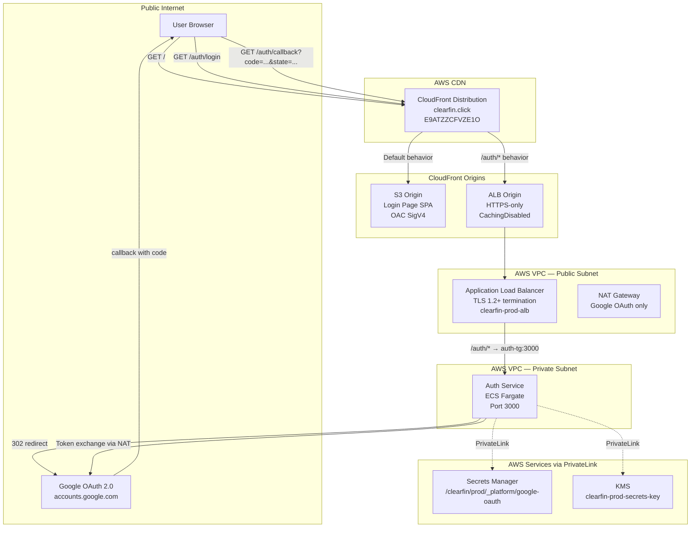
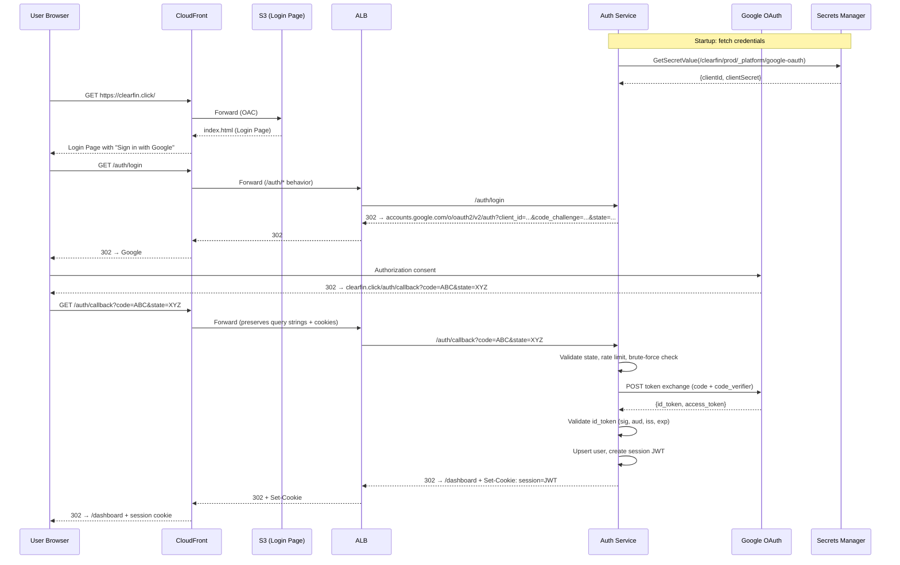

# Design Document: Google SSO Integration

## Overview

This design covers the operational wiring needed to make the existing ClearFin Google SSO authentication flow functional in production at `https://clearfin.click`. The auth-service application code (PKCE, session management, callback validation, token exchange, id_token validation) already exists in `packages/auth-service/`. The login page SPA exists in `packages/login-page/`. The infrastructure (ECS Fargate, ALB, CloudFront, VPC with PrivateLink endpoints) is deployed but ECS services are at `desiredCount: 0`.

The work is primarily configuration and wiring:
1. Add an ALB origin to the CloudFront distribution with `/auth/*` cache behavior
2. Provision Google OAuth credentials in Secrets Manager
3. Configure auth-service environment variables and secrets retrieval
4. Scale the auth-service ECS Fargate service to `desiredCount: 1`
5. Redesign the login page with a premium fintech aesthetic per the frontend-design steering
6. Verify the end-to-end OAuth flow

### Key Design Decisions

1. **CloudFront as the single entry point**: All traffic (static SPA and auth API) flows through CloudFront at `clearfin.click`. The `/auth/*` path pattern routes to the ALB origin while everything else serves from S3. This avoids exposing the ALB domain directly and keeps a single TLS termination point for users.
2. **CachingDisabled for auth endpoints**: OAuth callbacks carry state parameters, authorization codes, and session cookies that must never be cached. The `/auth/*` behavior uses CloudFront's managed `CachingDisabled` policy.
3. **AllViewerExceptHostHeader origin request policy**: Forwards all query strings, cookies, and headers (except `Host`) to the ALB so OAuth state parameters and session cookies are preserved. The `Host` header is excluded so the ALB receives its own DNS name, not `clearfin.click`.
4. **Secrets at runtime, never baked**: Google OAuth credentials are stored in Secrets Manager at `/clearfin/prod/_platform/google-oauth` and fetched by the auth-service at container startup. The task role already has KMS decrypt permissions; we add `secretsmanager:GetSecretValue` scoped to this specific secret ARN.
5. **Dark refined aesthetic for login page**: Following the frontend-design steering, the login page uses a dark theme with gold/amber accents, distinctive typography (DM Serif Display + DM Sans from Google Fonts), and atmospheric depth via gradient meshes and layered elements.

## Architecture



### CloudFront Routing

| Path Pattern | Origin | Cache Policy | Origin Request Policy | Notes |
|---|---|---|---|---|
| Default (`*`) | S3 (OAC) | Managed-CachingOptimized | — | Static SPA assets |
| `/auth/*` | ALB (HTTPS) | Managed-CachingDisabled | AllViewerExceptHostHeader | OAuth endpoints, no caching |

### OAuth Flow Sequence



## Components and Interfaces

### 1. CloudFront Distribution Changes (`static-hosting-stack.ts`)

The existing `StaticHostingCdkStack` creates a CloudFront distribution with an S3 origin. We add:

- **ALB Origin**: New `HttpOrigin` pointing to the ALB DNS name with `https-only` protocol policy
- **`/auth/*` Cache Behavior**: Additional behavior using `CachingDisabled` managed policy and `AllViewerExceptHostHeader` origin request policy
- **Props extension**: `StaticHostingCdkStackProps` gains an optional `albDnsName: string` prop passed from the compute stack

```typescript
// Addition to StaticHostingCdkStack constructor
if (props.albDnsName) {
  const albOrigin = new origins.HttpOrigin(props.albDnsName, {
    protocolPolicy: cloudfront.OriginProtocolPolicy.HTTPS_ONLY,
  });

  this.distribution.addBehavior('/auth/*', albOrigin, {
    viewerProtocolPolicy: cloudfront.ViewerProtocolPolicy.REDIRECT_TO_HTTPS,
    cachePolicy: cloudfront.CachePolicy.CACHING_DISABLED,
    originRequestPolicy: cloudfront.OriginRequestPolicy.ALL_VIEWER_EXCEPT_HOST_HEADER,
    allowedMethods: cloudfront.AllowedMethods.ALLOW_ALL,
  });
}
```

### 2. Secrets Manager Provisioning

Manual one-time operation (not CDK-managed, to avoid secrets in source control):

```bash
aws secretsmanager create-secret \
  --name "/clearfin/prod/_platform/google-oauth" \
  --kms-key-id "alias/clearfin-prod-secrets-key" \
  --secret-string '{"clientId":"<GOOGLE_CLIENT_ID>","clientSecret":"<GOOGLE_CLIENT_SECRET>"}' \
  --region il-central-1
```

The secret JSON schema:
```json
{
  "clientId": "string — Google OAuth 2.0 Client ID",
  "clientSecret": "string — Google OAuth 2.0 Client Secret"
}
```

### 3. IAM Policy Addition (`iam.ts`)

The `clearfin-prod-auth-service-task` role needs `secretsmanager:GetSecretValue` scoped to the google-oauth secret. Add an inline policy statement to the auth-service task role in `buildIamConfig()`:

```typescript
// New inline policy for auth-service task role
{
  name: 'secrets-read-google-oauth',
  statements: [
    {
      Effect: 'Allow',
      Action: ['secretsmanager:GetSecretValue'],
      Resource: [
        `arn:aws:secretsmanager:${region}:${accountId}:secret:/clearfin/${env}/_platform/google-oauth-*`
      ],
    },
  ],
}
```

The wildcard suffix (`-*`) accounts for the random 6-character suffix Secrets Manager appends to secret ARNs.

### 4. Auth Service Environment Variables (`ecs.ts`)

Add production configuration environment variables to the auth-service task definition:

```typescript
environment: {
  NODE_ENV: env,
  SERVICE_NAME: 'auth-service',
  GOOGLE_OAUTH_SECRET_NAME: `/clearfin/${env}/_platform/google-oauth`,
  REDIRECT_URI: `https://clearfin.click/auth/callback`,
  REDIRECT_URI_ALLOWLIST: `https://clearfin.click/auth/callback`,
  DASHBOARD_URL: `https://clearfin.click`,
  EXPECTED_ISS: 'https://accounts.google.com',
  PORT: '3000',
}
```

Note: `clientId` and `clientSecret` are NOT in environment variables — they are fetched from Secrets Manager at runtime per the security practices.

### 5. ECS Service Activation (`compute-stack.ts`)

Change `desiredCount` from `0` to `1` for the auth-service. This is a CDK deployment change — update the service config or override in the stack. The existing `desiredCount: 0` comment says "scale up after initial stack creation to avoid CF timeout", so this is the intended activation step.

### 6. Login Page Redesign (`login-page.ts`)

Complete visual overhaul of `renderLoginPage()` and `getStyles()` following the frontend-design steering:

- **Typography**: DM Serif Display (headings) + DM Sans (body) from Google Fonts
- **Color palette**: Dark refined theme with CSS custom properties
  - `--bg-primary: #0a0a0f` (deep dark)
  - `--bg-card: #12121a` (elevated surface)
  - `--accent-gold: #c9a84c` (primary accent)
  - `--accent-gold-light: #dfc06e` (hover state)
  - `--text-primary: #e8e6e1` (high contrast on dark)
  - `--text-secondary: #8a8a8e` (muted text)
- **Layout**: Full-viewport split or asymmetric composition with atmospheric gradient mesh background, not a centered card on flat background
- **Animations**: Staggered page-load reveals via CSS `@keyframes`, button hover transitions, subtle gradient animation
- **Accessibility**: WCAG 2.1 AA contrast ratios maintained (gold on dark ≥ 4.5:1), keyboard focus indicators, `aria-label` attributes, `role="alert"` for errors
- **Responsive**: Fluid layout 320px–1920px with CSS clamp() for typography scaling

### 7. CSP Update (`cloudfront.ts` / `login-page.ts`)

Update the Content-Security-Policy to allow Google Fonts CDN:

```
style-src 'self' 'unsafe-inline' https://fonts.googleapis.com;
font-src https://fonts.gstatic.com;
connect-src 'self' https://clearfin.click;
```

## Data Models

### Secrets Manager Secret Schema

**Path**: `/clearfin/prod/_platform/google-oauth`
**Encryption**: AES-256 via `clearfin-prod-secrets-key` KMS key

```typescript
interface GoogleOAuthSecret {
  clientId: string;   // Google OAuth 2.0 Client ID
  clientSecret: string; // Google OAuth 2.0 Client Secret
}
```

### Auth Service Runtime Config (derived from env vars + secrets)

```typescript
interface AuthServiceRuntimeConfig {
  // From Secrets Manager at startup
  googleClientId: string;
  googleClientSecret: string;
  // From environment variables
  redirectUri: string;           // https://clearfin.click/auth/callback
  redirectUriAllowlist: string[]; // [https://clearfin.click/auth/callback]
  dashboardUrl: string;          // https://clearfin.click
  expectedIss: string;           // https://accounts.google.com
  expectedAud: string;           // same as googleClientId
  port: number;                  // 3000
}
```

### CloudFront Distribution Config Extension

```typescript
interface AlbOriginConfig {
  albDnsName: string;           // ALB DNS name from compute stack
  protocolPolicy: 'https-only';
  cacheBehaviorPath: '/auth/*';
  cachePolicy: 'CachingDisabled';
  originRequestPolicy: 'AllViewerExceptHostHeader';
}
```

### Login Page Config (existing, unchanged)

```typescript
interface LoginPageConfig {
  authLoginUrl: string;   // '/auth/login'
  dashboardUrl: string;   // '/dashboard'
  appOrigin: string;      // 'https://clearfin.click'
}
```


## Correctness Properties

*A property is a characteristic or behavior that should hold true across all valid executions of a system — essentially, a formal statement about what the system should do. Properties serve as the bridge between human-readable specifications and machine-verifiable correctness guarantees.*

This feature is primarily infrastructure wiring and configuration, so most acceptance criteria are SMOKE or EXAMPLE tests (CDK assertions, config checks). Two criteria yield meaningful properties:

### Property 1: Error messages never leak internal details

*For any* error query parameter value (including arbitrary strings, special characters, and injection attempts), `handlePostAuth` SHALL return `kind: "error"` with the fixed generic message `"Something went wrong during sign-in. Please try again."` — never exposing the raw error value in the output.

**Validates: Requirements 6.5**

### Property 2: CSP connect-src includes the configured origin

*For any* valid HTTPS origin string, `buildCspHeaderValue(origin)` SHALL produce a CSP header where the `connect-src` directive contains that exact origin string.

**Validates: Requirements 7.3**

## Error Handling

### Auth Service Startup Failures

| Failure | Behavior | Log Level |
|---|---|---|
| Secrets Manager unreachable | Log error with secret path, exit process with code 1 | ERROR |
| Secret not found at path | Log error with secret name, exit with code 1 | ERROR |
| Secret JSON malformed (missing clientId/clientSecret) | Log error with field names (not values), exit with code 1 | ERROR |
| KMS decrypt failure | Log error, exit with code 1 | ERROR |

On any startup failure, the ECS task exits non-zero. The ECS service scheduler restarts the task. After 3 consecutive failures, the ALB health check marks the target as unhealthy (30s interval × 3 unhealthy threshold = 90s detection).

### OAuth Flow Errors

These are already handled by the existing auth-service code:

| Step | Error | HTTP Response | User Experience |
|---|---|---|---|
| Login redirect | Invalid redirect URI | 400 | Should not occur (hardcoded config) |
| Callback validation | Rate limit exceeded | 429 | Login page shows generic error |
| Callback validation | Brute-force blocked | 403 | Login page shows generic error |
| Callback validation | State mismatch | 403 | Login page shows generic error |
| Token exchange | Network error to Google | 502 | Login page shows generic error |
| Token exchange | Invalid grant | 502 | Login page shows generic error |
| id_token validation | Signature/aud/iss mismatch | 401 | Login page shows generic error |
| Session creation | Signing/encryption failure | 500 | Login page shows generic error |

All errors redirect back to the login page with `?error=auth_failed`. The login page displays the generic message: "Something went wrong during sign-in. Please try again." Internal error details are never exposed to the client (per security practices).

### CloudFront Routing Errors

| Scenario | Behavior |
|---|---|
| ALB origin unreachable | CloudFront returns 502/503 to client |
| Auth service unhealthy (all targets) | ALB returns 503, CloudFront forwards to client |
| S3 origin 403/404 | CloudFront custom error response returns index.html with 200 (SPA routing) |

## Testing Strategy

### Testing Approach

This feature is primarily infrastructure configuration and wiring. The testing strategy reflects this:

- **CDK assertion tests**: Verify CloudFront distribution has ALB origin, `/auth/*` behavior, correct policies
- **Config builder unit tests**: Verify `buildEcsClusterConfig()`, `buildIamConfig()`, `buildCloudFrontConfig()` produce correct values
- **Login page unit tests**: Verify HTML output contains required elements (Google Fonts, CSS custom properties, animations, branding, accessibility attributes)
- **Property-based tests**: Two properties covering error message safety and CSP correctness
- **Integration tests**: End-to-end OAuth flow verification (manual or scripted against deployed environment)

### Property-Based Tests

Library: `fast-check` (already used in the project)
Minimum iterations: 100 per property

Each property test references its design document property:

```
// Feature: google-sso-integration, Property 1: Error messages never leak internal details
// Feature: google-sso-integration, Property 2: CSP connect-src includes the configured origin
```

### Unit Tests (Example-Based)

| Test | Validates |
|---|---|
| `buildIamConfig()` includes secretsmanager:GetSecretValue for google-oauth on auth-service-task role | Req 2.3 |
| Auth service startup exits non-zero on Secrets Manager failure | Req 2.5 |
| `buildEcsClusterConfig()` auth-service env vars contain correct REDIRECT_URI, DASHBOARD_URL, EXPECTED_ISS | Req 4.1–4.4 |
| `renderLoginPage()` HTML contains "Sign in with Google" button | Req 6.1 |
| `initiateOAuthRedirect()` calls navigate with '/auth/login' | Req 6.2 |
| `renderLoginPage()` HTML contains Google Fonts link | Req 8.2 |
| `renderLoginPage()` CSS contains custom properties | Req 8.3 |
| `renderLoginPage()` CSS contains @keyframes | Req 8.4 |
| `renderLoginPage()` HTML contains ClearFin branding | Req 8.6 |
| `renderLoginPage()` HTML contains aria-label and :focus-visible styles | Req 8.7 |
| `renderLoginPage()` CSS contains @media responsive queries | Req 8.8 |

### CDK Assertion Tests (Smoke)

| Test | Validates |
|---|---|
| CloudFront distribution has ALB HttpOrigin with HTTPS-only protocol | Req 3.1, 3.5 |
| CloudFront distribution has `/auth/*` cache behavior with CachingDisabled | Req 3.2 |
| CloudFront `/auth/*` behavior uses AllViewerExceptHostHeader origin request policy | Req 3.3 |
| ALB HTTPS listener default action routes to auth-tg | Req 3.4 |
| Auth-service Fargate service desiredCount is 1 | Req 5.1 |
| Auth-service Fargate service assignPublicIp is false | Req 5.3 |

### Integration Tests (Post-Deployment)

| Test | Validates |
|---|---|
| `curl -I https://clearfin.click/` returns 200 with login page HTML | Req 6.1 |
| `curl -I https://clearfin.click/auth/login` returns 302 to accounts.google.com | Req 6.3 |
| ALB target group shows healthy targets for auth-service | Req 5.2 |
| Secret exists at `/clearfin/prod/_platform/google-oauth` with correct KMS key | Req 2.1, 2.2 |
| VPC has secretsmanager PrivateLink endpoint | Req 5.4 |
